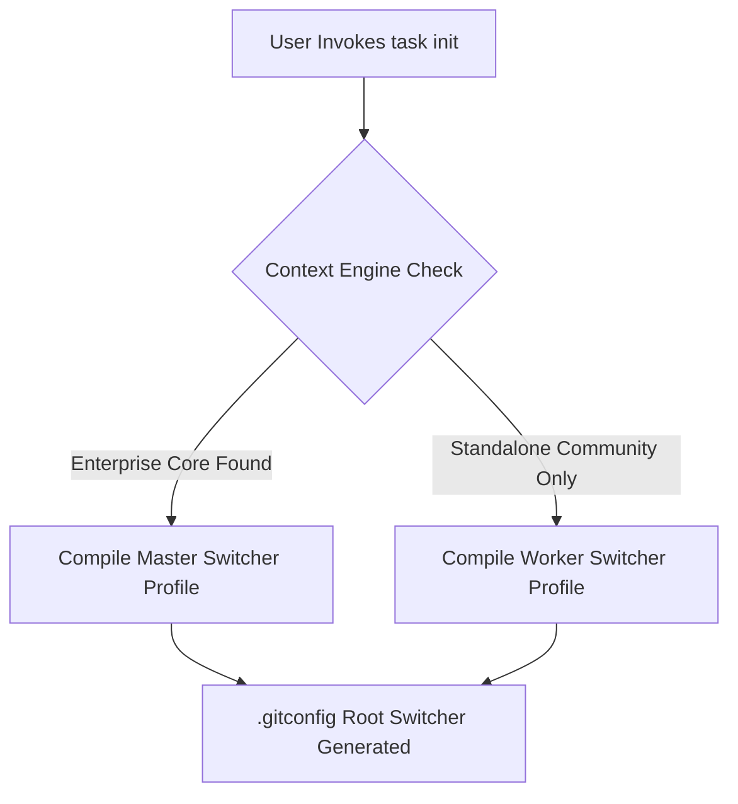

# L-TDD SPECIFICATION: ARCHITECTURAL DESIGN AND THEORIZATION

## ENVIRONMENT ABSTRACT ROUTING PATTERN

The architecture relies on the implementation of a decentralized Context Switcher executing directly at the workspace root directory.
By leveraging Git's native conditional inclusion mechanisms (`includeIf`), the system evaluates the absolute file system path at execution time.

## CONTEXT DETECTION LOGIC

The engine scans for specific folder patterns using a case-insensitive, wildcard-matching POSIX router string:

1. `gitdir/i:**/lorein/ecosystem-hub/` -> Automatically activates private enterprise credentials and encryption schemas.
2. `gitdir/i:**/lorein/community-bridge/` -> Activates public open-core profiles.

## LOGICAL MACRO ARCHITECTURE DIAGRAM

## DATA INTEGRITY BOUNDED CONTEXT

To prevent configuration drift, the baseline environment parameters are treated as immuable data structures versioned inside the central corporate governance submodule repository (`gov-work-registry`).
The local workspace acts as a strict downward-only consumer of these global laws.
