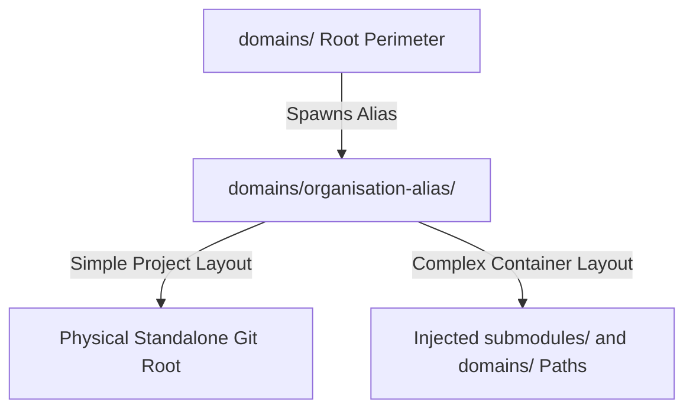

# LOREIN DOMAINS ACTIVE REGISTRY

## 1. DOMAIN-AS-CODE EMBEDDING MECHANICS

### 1.1 Structural Slave Imbrication
The domains directory houses the qualified corporate sub-organizations managed by Lorein-org.
Every sub-organization maps to an isolated sub-folder labeled via its qualified semantic alias name.
A standard repository layout operates as a standalone package containing isolated domain text.
A container repository layout injects submodules and nested domain tracks to trigger infinite loops.

### 1.2 Cellular Scission Protocol
When volumetric storage boundaries threaten client memory spaces, a scission routine triggers.
The current domain detaches from the main tracking tree to operate as an independent container.
This execution preserves downstream operational contracts by utilizing stable git submodules mapping layers.

## 2. ACTIVE VIRTUAL PERIMETERS INDEX

- **organisation-alpha:** Placeholder context mapping the initial downstream enterprise partner workspace.
